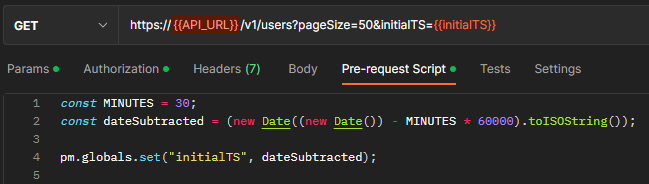
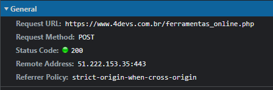
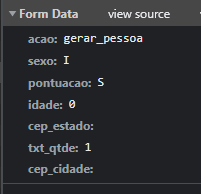
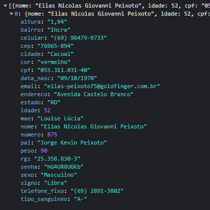

Today I will show how I automated part of my API tests using Postman and pre-request scripts to generate random stuff from specific APIs.
 
### Uderstanding postman Pre-request Scripts
Postman provides us with a panel that uses JavaScript language to create behaviors before requests, like text transforms, data collect and save this in variables to use in request. These behaviors are scripts written in JavaScript, so the range of things we can do with this is enormous.

Using Pre-request Scripts are easy, with a little reading in the documentation you can create great things. See this example:



In this example, I subtracted 30 minutes from the current date and stored it in a global variable. Then I used the global variable in the API URL, as we can see in the image.

This is a small example of what we can do, let's get started?

### What's my problem?
My problem is simple, i want to generate random user data to use in my API payload. But Postman already has that! Yes, but i'm Brazilian, and my random data should be local.

The random data that postman provides is based on faker, which uses localization, but unfortunately the available variables are localized only in en-US.

Chalenge accepted.

### How did i solve this?
#### Finding the random data API
There is a very useful tool for us Brazilian devs, the site [4devs.com.br](https://www.4devs.com.br/). It is perfect, besides generating all kinds of random data, it generates valid data! Ideal for validation tests.

And this is a [People Generator](https://www.4devs.com.br/gerador_de_pessoas), but this isn't an API. But, nothing that an inspection can't solve. The DevTools ninjas will understand me, see this:

 
Above is the request and the payload.

And here is the return.


#### Implementing the soluction

Then I simply used the method `pm.sendRequest` for send post to finded request and `pm.globals.set` to set the values to global variables. Ideally, you should set it to environment variables, not global, that way you just change `globals` to `environment`. 

```javascript
const postRequest = {
  url: "https://www.4devs.com.br/ferramentas_online.php",
  method: 'POST',
  header: {
    'Content-Type': 'application/x-www-form-urlencoded',
    'origin': 'https://www.4devs.com.br'
  },
  body: {
    mode: 'urlencoded',
    urlencoded: [ 
        { key: 'acao', value: 'gerar_pessoa' },
        { key: 'sexo', value: 'I' },
        { key: 'pontuacao', value: 'S' },
        { key: 'idade', value: 0 },
        { key: 'cep_estado', value: null },
        { key: 'txt_qtde', value: 1 },
        { key: 'cep_cidade', value: null },
    ]
  }
}

// here i created a filterValue function to make some transformations

pm.sendRequest(postRequest, function (err, response) {
    for (const [key, value] of Object.entries(response.json()[0])) {
        pm.globals.set(`4devs.${key}`, filterValue(key, value));
    }
});
```
### Conclusion
This article demonstrates just a small of what Pre-request Scripts are capable of. This way you can expand your knowledge about this concepts by read the articles and documentations listed below. And go beyond!

Thanks for spending your time here, please share, comment, like and subscribe [my newsletter](https://joismar.hashnode.dev/newsletter) for more. See you later 👋🏼.
